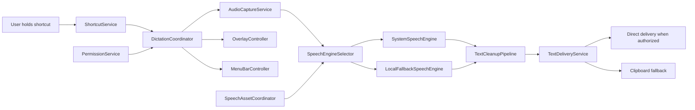

# Architecture

This file begins as the agreed target. Replace assumptions with implementation
facts as P2–P5 complete.

## Rules

- one active dictation session at a time;
- no transcript/audio network path;
- no hard dependency on optional cleanup enhancement;
- no UI dependency on engine brand/model details;
- direct delivery is optional; retained text is mandatory;
- all services must be independently testable with fakes.

## P1 implementation boundaries

- `SystemSpeechEngine` is the primary candidate because the installed macOS
  26 SDK exposes the modern Speech module types needed for a spike.
- `LocalFallbackSpeechEngine` may wrap original FluidAudio/WhisperKit concepts
  only after model terms, binary size, memory, and App Store behaviour are
  verified.
- `SpeechAssetCoordinator` must hide engine/model details from normal UI. It
  may present repair states, not model folders or Hugging Face choices.
- `TextDeliveryService` must preserve text through clipboard fallback whenever
  direct delivery fails or is not permitted.
- No source module may hard-code old absolute paths such as
  `/Users/macbookpro/local_ai_models/voice_models`.
